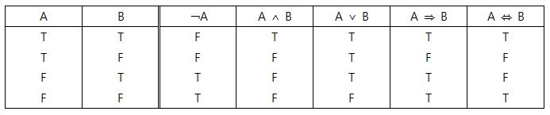
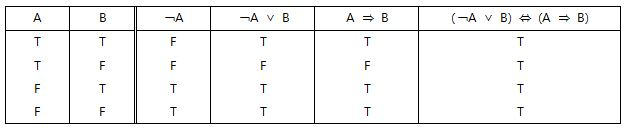
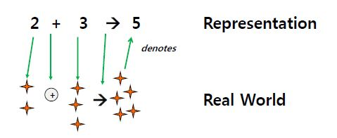
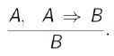
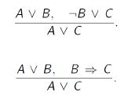
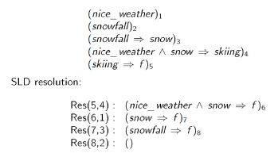

# 1_Propositional_Logic

### 논리 / Logic

- 논리는 Symbolic Language이다.

- AI 분야에서 수학적으로 잘 정의한 언어를 사용해야 함, 그러므로 **논리**에 대해 공부해야 하는 것

- [Proposition Logic(명제 논리)](https://ko.wikipedia.org/wiki/명제_논리)

  [Predicate Logic(서술 논리 / 1차 서술 논리 / 1차 논리)](https://ko.wikipedia.org/wiki/술어_논리)

- Propositional Logic ⊃ Predicate Logic

## Syntax / 문법

### Operation

|      Operation      |         Read         |
| :-----------------: | :------------------: |
|          t          |        "true"        |
|          f          |       "false"        |
|   ￢ A (negation)   |       "not A"        |
| A ∧ B (conjunction) |      "A and B"       |
| A ∨ B (disjunction) |       "A or B"       |
| A ⇒ B (implication) |    "A implies B"     |
| A ⇔ B (equivalence) | "A if and only if B" |

- A ⇒ B 은 ￢ A ∨ B로도 쓰인다.
- A ⇔ B 은 (A ⇒ B) ∧ (B ⇒ A)로도 쓰인다.

### Formula(Proposition)

- 논리에서 '문장'이라고 표현되는 것 모두

- `A ∧ B`, `A ∧ A ∧ A`,  `(￢ A ∧ B) ⇒ (￢ C ∨ A)` 등의 표현식 모두 **Formula**라고 한다.

- **atomic formula(또는 proposition variable)** : A, B와 같이 truth 값이 들어가는 formula

  **compound formula** : ￢, ∧, ∨, ⇒, ⇔ 를 이용하여 표현되는 formula

## Semantics / 의미론

- formula가 참(true)인지 거짓(false)인지 정하는 것을 말한다.
- formula의 참과 거짓을 정하는 함수(mapping)을 정의하는 것으로부터 시작

### Mapping

- **Interpretation(assignment)** : 모든 formula의 truth값(true/false)을 지정하는 함수를 의미한다.
- **world** : proposition variable을 가지고 만들 수 있는 interpretation의 집합을 의미한다.
  - proposition variable이 n개면, interpretation은 2^n개

### 명제 논리의 의미론

- **mapping function I**

  - I(A ∨ B)의 값은 I(A)와 I(B)의 값에 의해 결정된다.

    따라서, I(A)가 참이거나 I(B)이 참이면 I(A ∨ B)이 참이 된다.

    `I(A ∨ B)=t iff I(A)=t or I(B)=t` 
    
  - 문법에서 정의한 모든 formula의 정의에 대해 truth value를 정의해야 한다.

    -> 진리표(Truth Table)로 정리

### Truth Table

- empty formula는 모든 interpretations에 대해 true
- `A ≡ B`는 `A ⇔ B`를 설명하기 위한 **Meta Language**라고 할 수 있다.

### Satisfiability

- **Satisfiable** : 어떤 formula가 최소한 하나의 interpretation(world)에서 참일 때

- **Valid(logically valid)** : 어떤 formula가 모든 interpretation에서 참일 때

  - 이 때의 formula를 **tautology**라고 한다.

    ex) `A ∨ ￢A`는 tautology

- **Model** : 어떤 formula가 satisfiable일 때, 그 때의 interpretation을 의미
- **Unsatisfiable** : 어떤 formula가 모든 interpretation에서 거짓일 때

## Proof Systems

### Theorems

- 항상 참인 formula를 의미(valid formula)

- 증명 : 모든 proposition variable에 대한 truth table을 만들어 주어진 formula가 항상 참인 것을 보여주면 된다.

- ex) `￢A ∨ B ⇔ A ⇒ B`(De Morgan's Law)

  

### Entailment

- 이미 주어진 formula(또는 Knowledge) A가 참이 되는 모든 Interpretation(world)에서 어떤 또 다른 formula B가 참이 될 때, A로부터 B가 유도된다고 하며 이를 '**Entailment**'라고 한다.

- KB(Knowledge Base)가 `A ∧ B`일 때, *KB entails A*라고 하며 **KB ╞ a**라고 표기한다.

  - KB는 formula들의 집합이라고 할 수 있다.

- ex) KB = {A, ￢A ∨ B}일 때, **KB ╞ B** *(KB entails B)*이다.

  이는 KB 내의 모든 formula, A와 ￢A ∨ B 모두 참일 때, B가 반드시 참이 된다는 의미

### Deduction Theorem

> *A ╞ B if and only if ╞ A ⇒ B*

- **'*╞ A ⇒ B*' 의 의미**

  ╞ 의 왼측에 아무 것도 없는 것은 KB가 공집합 ∮ (empty set)임을 의미한다. 

  이는 KB가 없어도(지식이 없어도) 'A ⇒ B'가 항상 참이라는 의미다.(valid formula / tautology)

  *(증명은 후에 정리)*

### proof by contradiction / 귀류법

> *KB ╞ Q if and only if KB ∧ ￢Q is unsatisfiable*

- ex) KB = {A, ￢A ∨ B}일 때, 위의 식을 증명하라.

  i. KB ∪ {￢B} = {A, ￢A ∨ B, ￢B}

  ii. KB가 항상 참이면, 그 안에 있는 formula가 모두 참이어야 한다.

  iii. A와 ￢A ∨ B가 참이면, B는 항상 참이다.

  iv. ￢B도 참이다.

  v. (iii)과 (iv)에 의해 contradiction이 생긴다.

  vi. 따라서 `KB ∧ ￢Q`는 unsatisfiable하다.

### Derivation

- **KB┣ A**
  - *'Formula A가 KB로부터 derive 되었다.'*
  - KB 내에 있는 formula로부터 궁극적으로 증명하려는 formula가 나오도록 유도하는 과정을 통해 Entailment를 증명하는 것을 의미
  - 추론 규칙 적용
- **KB┣ p A**
  - *'프로그램 p가 formula A를 KB로부터 derive했다.'* 

### [Denotation Semantics](https://ko.wikipedia.org/wiki/표시적_의미론)

- 설명은 위의 단어 클릭

## Resolution

### theorem prover(program)

- KB로부터 어떤 formula A가 derive하는지 증명하는 프로그램을 의미
- `if KB ├p Q then KB ╞ Q` 일 때, theorem prover p는 **sound**하다고 한다.
- `if KB ╞ Q then KB ├p Q` 일 때, theorem prover는 **complete**하다고 한다.
- **Resolution**은 Sound & Complete한 theorem prover를 만들기 위한 방법 

### Proof calculus(inference rule)

- **[Modus Ponens](https://ko.wikipedia.org/wiki/전건_긍정)** / 긍정 논법

  - 가언 명제와 전제로부터 결론을 유도하는 추론 규칙

  
  
  - Sound 하지만 complete하지 않다.

### Resolution Inference Rule

- **Resolvent** : Derived clause를 의미
- 이 resolution rule은 **modus ponens의 일반식**이다.

### CNF(Conjunctive Normal Form) / 논리곱 표준형

- clause를 표현할 땐 dijunction을, clause를 연결할 때는 conjunction을 사용하여 표현한 논리식

  `(A ∨ B ∨ ￢C) ∧ (A ∨ B) ∧ (￢B ∨ ￢C)`

### General resolution rule

- **complementary** : 위 식에서의 B와 ￢B의 관계를 의미 

- resolution calculus가 CNF에서 proof of unsatisfiabiliy(proof by contradiction)이면,**sound**하고 **complete**하다.

  - 이 얘기는 proof by contradiction을 이용하면 sound & complete한 theorem prover를 만들 수 있다는 것이다.

    > **KB ╞ A 를 증명하기 위해**
    >
    > (i) formula A를 부정한 ￢A를 KB에 추가한다.
    >
    > (ii) 이 KB가 inconsistent하다(contradiction이 생긴다)는 것을 증명

### Transfer to CNF

- A ⇔ B ≡ (A ⇒ B) ∧ (B ⇒ A)
- A ⇒ B ≡ ￢A ∨ B
- ￢￢A ≡ A (double-negation elimination)
- ￢(A ∧ B)  ≡ (￢A ∨ ￢B) (De Morgan)
- ￢(A ∨ B)  ≡ (￢A ∧ ￢B) (De Morgan)

## Horn Clauses

- positive literal를 많아야 1개만 포함하는 Clause를 의미한다.

- `A1 ∧ A2 ∧ ... ∧ An ⇒ B, A1, ..., An과 B는 모두 atomic formula`

  - 왼쪽 파트 : antecedent
  - 오른쪽 파트 : consequent(head)

- **SLD resolution**(Selection rule driven linear resolution for definite clauses)

  ex)

  

## Computability and Complexity

## Applications and Limitations

