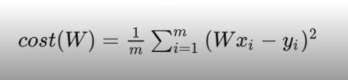

# Lec 02 - Simple Linear Regression

> 단순 선형 회귀 : ML의 핵심 개념

## Regression이란?

- 사전적으로는 후퇴, 퇴보의 의미

- **Francis Galton(통계학자/인류학자)** 

  *"Regression toward the mean(평균)"*

  즉, 어떤 Data들의 크기와 상관 없이 이 Data들은 **전체 평균**으로 회귀하려는 특징을 갖고 있다는 의미

## Linear Regression

- 선형회귀 : 데이터를 가장 잘 대변하는 직선을 방정식으로 나타낸 것
- **y = ax + b**
  - 우리가 구해야 하는 것: a, b
- 어떤 Data들의 입력과 출력의 관계(증감)를 표현

## Hypothesis

- 어떤 데이터들이 있을 때 이에 대해 가장 잘 대변하는 직선의 식을 **H(x) = Wx+b** 라고 가정해보자
  - W : Weight
  - b : Bias
- 이 때 W와 b의 값을 어떻게 구할 수 있을까?

## Cost

> 동의어 : loss, error

- **H(x) - y**

  - x값에 의한 H(x) 값과 실제 Data의 y값 사이의 차이

  - 각 Cost의 값들의 평균이 작을수록 해당 직선이 Data를 잘 대변한다는 것을 의미

    - 이 때 Cost는 음수가 나올 수 있기 때문에, Cost를 제곱을 한 값을 합하여 평균을 구하도록 한다.

      

- **How fit the line to our (training) data**
- **Goal : *minimize cost(W, b)***

