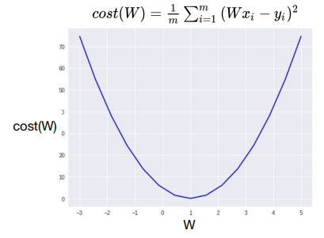
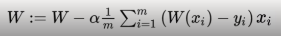
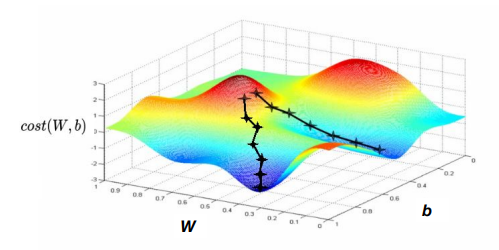
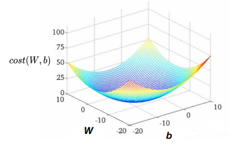

# Lec 03 - Linear Regression and How to minimize cost

> 선형 회귀(Linear Regression)의 비용을 최소화 하는 방법 강의

### 간략화된 수식(Simplified Hypothesis)

- b(bias)을 생략한다.

#### Hypothesis

H(x) = Wx

#### Cost

## What cost(W) looks like?

| x    | y    |
| ---- | ---- |
| 1    | 1    |
| 2    | 2    |
| 3    | 3    |

- 위 데이터에 대한 H(x) = Wx 회귀함수의 W 값을 찾아보자
- W값 설정 후 Cost 함수에 대입하여 적정 W값을 찾아냄

### Result

- W = 0, cost(W) = 4.67
- W = 1, cost(W) = 0
- W = 2, cost(W) = 4.67
- W = 3, cost(W) = 18.67

## How to Minimize cost?

- Cost 함수의 그래프는 아래로 볼록한 2차 함수 그래프 형태. 이 때의 최솟값은 미분이 0인 값.

  

- 위의 예제 Data와 Cost 함수를 보면 W=1일 때, cost가 최소임
  
  - 즉, cost = error 가 가장 적은 W는 1이라는 결론을 낼 수 있음
- 이를 컴퓨터가 찾는 방법은 무엇일까!?

### Gradient Descent Algorithm(경사 하강법/경사 하강 알고리즘)

> 경사를 따라 내려가면서 최저점을 찾아가는 방법

- 엔지니어링 문제는 보통 최적화에 달려 있다. 
  - 최적화의 목적 : 이득 최대화 or 손실 최소화

- 경사 하강법으로 dataset을 cost function에 대입했을 때 최솟값이 나오는 W와 b(또는 그 외 다수의 변수)를 찾는 것이 목표 

### How it works?

- W, b에 임의값 대입(ex. W=0, b=0)
  - 위의 예제에서는 b가 없으므로 W=0만 고려
- cost(W)가 작아지는 방향으로 지속적으로 W, b 값 변경(cost function의 기울기 값이 0이 되는 방향 / 미분...!)
  - cost function의 한 지점 값 구하기 → 그 지점의 기울기 구하기 → `W -= W * (Gradient)` → 가장 작은 cost(W) 값이 나왔다고 판단될 때까지 ***반복*** → 이 때의 W가 최적의 W

### How to get a gradient

#### 수학적 설명

- cost(W,b) 함수의 (편)미분값을 사용
- 미분 시 수식의 간소화를 위해 기존에 m으로 나누는 것을 2*m으로 나눔(이는 cost(W,b)에 직접적인 영향을 주지 않음)
- W updating formal definition의 **α** : **Learning Rate**
  - 우리가 구한 기울기 값을 얼마나 적용을 시킬지, 그 양에 대한 값
  - 클수록 W의 변화가 크고, 작으면 W의 변화가 작음
  - 대체적으로 작은 상수

- 자세한 수식 도출은 PDF 참고

#### 프로그래밍적 설명

- 실제로는 미분하는 공식을 직접 작성할 일은 없음
- 미분 계산하는 사이트나 tensorflow의 자동 미분 엔진을 이용
- 다만, **α(Learning Rate)**를 얼마나 잘 설정하느냐가 관건(Our task for making a model)

## Convex Function

### 예시 1

- Local Minimum : 주변에 비해 낮은 지점(기울기가 0인 지점)

- Local Minimum이 다수일 때는, cost(W, b)의 최솟값에 도달할 수 있을 것이라는 확신 X

  → 이 경우에는 Gradient Descent 사용 불가

### 예시2(Convex Function)

- Local Minimum과 Global Minimum이 일치하는 경우

- 이는 Local Minimum이 1개만 존재

  → 이 경우에는 Gradient Descent를 사용 가능

---

## 실습

### numpy 문법

>  동종의 다차원 배열을 나타낼 때 쓰는 파이썬 기본 라이브러리

#### numpy.linspace(*start*, *stop*, *num=50*)

- start 값부터 stop 값까지 num(50) 구간으로 나눈다.
- return의 자료형 : ndarray
- 이외의 지정 매개변수는 [https://numpy.org/doc/stable/reference/generated/numpy.linspace.html](https://numpy.org/doc/stable/reference/generated/numpy.linspace.html) 참고

### Tensorflow 문법

#### tensorflow.multipy(A, B)

- A와 B를 곱한다.

#### A.assign(B)

- B를 A에 assign한다. (A가 B값으로 update)

#### tensorflow.random.set_seed(x)

- 인수 x 값에 의해 정해진 랜덤값을 유지
- 이후 초기화 또는 타 PC 이용 시에도 유지가 되게 하기 위함
- tensorflow 1.x 버전 : `tensorflow.set_random_seed(x)`

#### tensorflow.random.normal()

- 랜덤값 설정
- tensorflow 1.x 버전 : `tensorflow.random_normal(x)`