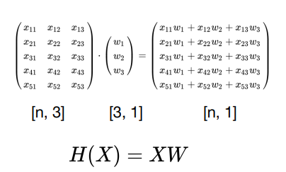

# Lec 04 - Multi-variable Linear Regression

> 다중 선형 회귀(Multi-variable Linear Regression)의 개념을 알아본다.

[TOC]

## Recap

- [Hypothesis](./Lec 02 - Simple Linear Regression#Hypothesis)
- [Cost function](./Lec 02 - Simple Linear Regression#Cost)
- [Gradient Descent](./Lec 03 - Linear Regression and How to minimize cost/#How to get a gradient)

## One- vs Multi- variable Linear Regression

### One-Variable(One-feature)

- 하나의 변수로 결과값을 예측하는 경우

| x(hours) | y(score) |
| -------- | -------- |
| 10       | 90       |
| 9        | 80       |
| 3        | 50       |
| 2        | 60       |
| 11       | 40       |

- 하나의 변수를 가지고 예측하는 것보단 다양한 변수를 가지고 예측하는 것이 더 효과적일 것
  - **Prediction Power(예측력)**

### Multi-variable(Multi-feature)

- 여러 개의 변수로 결과값을 예측하는 경우

| x1(quiz 1) | x2(quiz 2) | x3(midterm 1) | y(final) |
| ---------- | ---------- | ------------- | -------- |
| 73         | 80         | 75            | 152      |
| 93         | 88         | 93            | 185      |
| 89         | 91         | 90            | 180      |
| 96         | 98         | 100           | 196      |
| 73         | 66         | 70            | 142      |

- 새로운 학생의 x1, x2, x3 값으로 y값을 예측할 수 있을 것임
- instance : 데이터의 갯수(위의 경우에는 5개)

## Multi-variable Linear Regression Fomula

### Hypothesis

- H(x1, x2, x3) = w1x1 + w2x2 + w3x3 + b

### Cost function

## Matrix

- Multi-variable의 변수가 늘어 날수록 수식이 길어짐
- 이를 해결하기 위해 **행렬곱(Matrix multiplication)**를 이용하여 표현
  - Dot Product

- Tensorflow 코드에서는 X 행렬을 먼저 쓰고, W 행렬을 뒤에 씀

#### Hyporthesis Matrix

- (X의 column 갯수) == (W의 row 갯수)여야 행렬곱 가능
- 행렬곱의 장점 : 데이터(또는 instance)의 갯수와 무관하게 연산 가능
- 출력 갯수가 여러 개일 수도 있다.