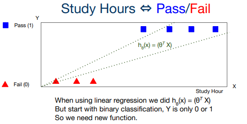
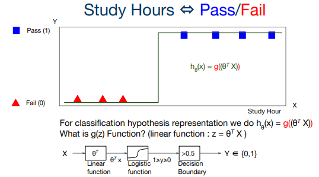
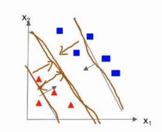
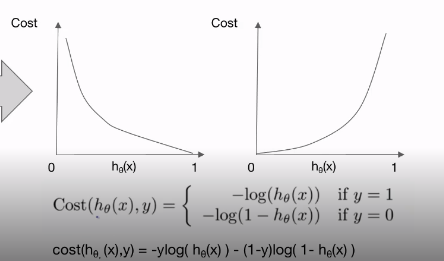

# Lec 05-1 - Logistic Regression/Classification 의 소개

> 로지스틱 회귀/분류(Logistic Regression/Classification)의 개념을 알아본다

[TOC]

## Logistic Regression이란?

- 서로 다른 특징을 가진 Data를 분류하는 분류 기법 중 하나

  (ex) 원, 삼각형 등과 같은 다른 도형을 분류하는 알고리즘

- Neural Network와 Deep Learning을 이해하는 기초가 될 것

## Classification

### Binary Classification

- Data를 두 가지 범주로 분류를 하는 알고리즘

  (ex) Exam : **Pass** or **Fail** (0 or 1)

- 후에 나올 Multi-class Classification의 기초가 될 것

## Logistic vs Linear

### Logistic

- Data를 두 가지 범위(또는 그 이상의 범위)로 나누는 경계선을 구하는 것

- Discrete(Counted)

  - 범주에 따라 데이터를 셀 수 있음
  - 데이터들이 흩어져 있음(구분 가능)

  ```python
  Logistic_Y = [[0], [0], [0], [1], [1], [1]] # One Hot
  ```

### Linear

- Data의 성질을 대표하는 선(1차 선형 함수)를 찾는 것

- 새로운 데이터 값이 들어와도 대표 함수와 오차 범위 내에 존재

- Continous(Measured)

  - 연속적인 데이터
  - 측량 가능

  ```python
  Linear_Y = [828.66, 833.45, 819.24, 828.35, 831.67] # Numeric
  ```

## Hypothesis Representation



- h_Θ(x) =(Θ^T*X)의 Linear Regression의 식으로 나타낼 수도 있긴 함
  - 하지만 Linear Regression처럼 연속되는 Data의 함수를 찾는 것이 아님
  - Data를 '**분류**'하는 기준을 찾는 것이 Classification의 목표



- function g를 통해 그래프를 꺾음
- [Decision Boundary](#Decision Boundary)

### Sigmoid (Logistic) function

> function g는 g(z)로 표현되며 0과 1 사이의 값을 반환

- z 값은 우리가 원래 구하던 linear function의 y값
- 이를 Sigmoid 함수를 통해 0 또는 1의 값으로 결과를 만들어 분류하게 되는 것

```python
hypothesis = tf.sigmoid(z) # z = tf.matmul(X, Θ) + b
hypothesis = tf.div(1., 1. + tf.exp(z)) # sigmoid
```

### Decision Boundary

> 분류를 하는 기준이 되는 g(z) 값을 의미

```python
predicted = tf.cast(hypothesis > -0.5, dtype=tf.int32)
```

----

# Lec 05-2 - Logistic Regression/Classification 의 cost 함수, 최소화

> 로지스틱 회귀/분류(Logistic Regression/Classification)의 비용함수를 최소화 하는 방법을 알아본다.

## Cost Function



- 처음에 만든 모델과, 궁극적으로 찾아야할 모델의 차이가 생길 수 있음 => 이 때의 이 차이를 **Cost**라고 함
- cost function은 모델과 비슷할 수록 0에 가까워지고, 다를수록 ∞에 가까워지기 때문에 log 함수를 쓰게 된다.



```python
def loss_fn(hypothesis, labels): # hypothesis : 가설, lables : 정답
    cost = tf.reduce_mean(labels * tf.log(hypothesis) + (1 - labels) * tf.log(1 - hypothesis))
    return cost
```

## Optimization

- cost function의 값을 minimization하는 방법
- 각 cost function 값의 경사값(미분값)을 최소(0)이 되는 곳을 찾는다.

```python
def grad(hypothesis, labels):
    with tf.GradientTape() as tape:
        loss_value = loss_fn(hypothesis, labels) # loss_fn 코드는 위의 예제 참고
    return tape.gradient(loss_value, [W, b])
optimizer = tf.train.GradientDescentOptimizer(learning_rate=0.01)
optimizer.apply_gradients(grads_and_vars=zip(grads, [W,b]))
```

---

# 실습

- matplotlib : 그래프 표시를 가능하게 하는 파이썬 라이브러리