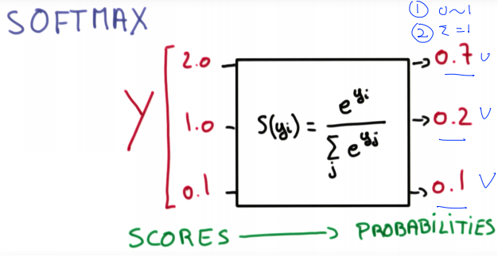
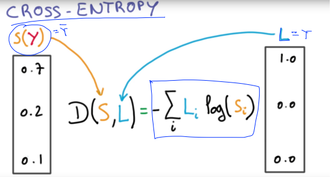
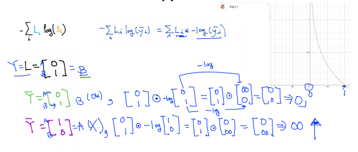

[TOC]

# Lec 06-1 - Softmax Regression: 기본 개념소개

> 다항 분류(Multinomial Classification)의 개념을 알아본다.

## Logistic Regression

- Linear Regression은 1차 선형함수로 표현되어 그 값이 다양한 실수로 나옴
- Sigmoid function 또는 Logistic Regression : 이를 0 또는 1로 분류하기 위해 새로운 g(z) 함수를 사용
- **X -> [W] -> z -> [Sigmoid] -> Y-hat**

- Y-hat은 Prediction으로 0과 1 사이의 값이 된다.
- 위의 분류 방식을 토대로 Multinomial classification에 응용한다.

## Multinomial classification

> 지금까지 했던 Logistic Regression은 두 영역으로 분류하는 '**Binary classification**'
>
> **Multinomial**은 3개 이상의 영역으로 분류할 때를 의미

- 위와 같은 데이터가 있을 때, 총 3개의 영역으로 분류해야 한다.
- Multinomial classification은 기본적으로 Binary classification으로 표현할 수 있다.

- 결과의 각 행이 곧 Z_A, Z_B, Z_C이며, 이를 각각의 Sigmoid에 넣어 Y_A, Y_B, Y_C를 구하면 된다.
  - 하지만 복잡하므로 다음 시간에 좀 더 자세히 설명
- ***강의 자료에 오류 有*** 
  - 예제 Data에서는 변수가 X1, X2 두 개이므로 행렬의 크기가 다음과 같아야 함
    - the size of matrix Weight : 3*2
    - the size of matrix X : 2*1

---

# Lec 06-2: Softmax Classifier의 cost함수

> 다항 분류(Multinomial Classification)의 비용함수를 알아본다.

## Where is Sigmoid?

- 지난 시간 예제

  

  

  - 구한 Z_A, Z_B, Z_C이며, 이를 각각의 Sigmoid에 넣어 Y_A, Y_B, Y_C의 결과를 도출함
    - 하지만 Sigmoid를 3번 써야 한다는 비효율이 발생

## Softmax

### Softmax의 역할

- 어떤 Score 값으로 나오는 Z(위에선 Y로 표현)를 확률로 변환

### One-Hot encoding

- softmax의 결과 [0.7, 0.2, 0.1] 중 하나를 고르기 위해 제일 큰 값을 1로 하고 나머지를 0으로 변환하는 encoding

## Cost Function

> 언제나 cost function은 예측 값과 실제 값의 차이를 줄이는 것이 목표(0과 가장 가까운 수를 만드는 Weight를 찾아야 함)
>
> Loss Function이라고도 함

### Cross Entropy

#### 증명

- ⊙ : element 곱

### Logistic cost vs. cross entropy

- [Logistic cost](./Lec 05 - Logistic Regression_Classification.md#Cost Function)은 곧 cross entropy 수식과 같음

### Gradient Descent

- 앞서 배운 Linear Regression / Logistic Regression과 마찬가지로 경사하강법을 이용하여 Cost Function을 최소화 하는 W 도출
- 미분 방법은 pass