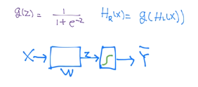
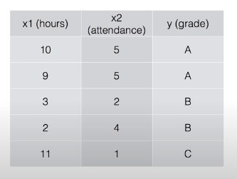
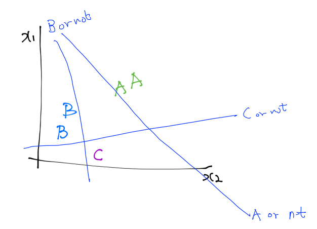
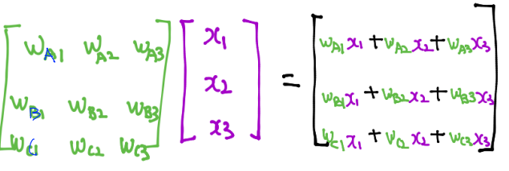

# Lec 06-1 - Softmax Regression: 기본 개념소개

> 다항 분류(Multinomial Classification)의 개념을 알아본다.

## Logistic Regression

- Linear Regression은 1차 선형함수로 표현되어 그 값이 다양한 실수로 나옴
- Sigmoid function 또는 Logistic Regression : 이를 0 또는 1로 분류하기 위해 새로운 g(z) 함수를 사용
- **X -> [W] -> z -> [Sigmoid] -> Y-hat**

- Y-hat은 Prediction으로 0과 1 사이의 값이 된다.
- 위의 분류 방식을 토대로 Multinomial classification에 응용한다.

## Multinomial classification

> 지금까지 했던 Logistic Regression은 두 영역으로 분류하는 '**Binary classification**'
>
> **Multinomial**은 3개 이상의 영역으로 분류할 때를 의미

- 위와 같은 데이터가 있을 때, 총 3개의 영역으로 분류해야 한다.
- Multinomial classification은 기본적으로 Binary classification으로 표현할 수 있다.

- 결과의 각 행이 곧 Z_A, Z_B, Z_C이며, 이를 각각의 Sigmoid에 넣어 Y_A, Y_B, Y_C를 구하면 된다.
- ***강의 자료에 오류 有*** 
  - 예제 Data에서는 변수가 X1, X2 두 개이므로 행렬의 크기가 다음과 같아야 함
    - the size of matrix Weight : 3*2
    - the size of matrix X : 2*1