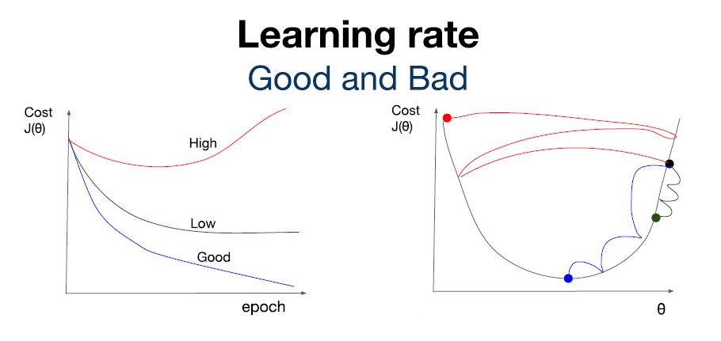
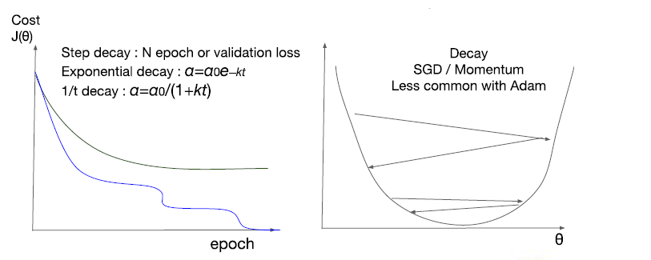

[TOC]

# Lec 07-1 - Application & Tips: 학습률(Learning Rate)과 데이터 전처리(Data Preprocessing)

> 학습률(Learning Rate)과 데이터 전처리(Data Preprocessing)에 대해 알아본다.

## Learning Rate

- 모델을 만들기 위한 hyperparameter 중 하나
  - *hyperparameter* : 미리 설정해두는 값
- 최적의 Gradient 도출하는 데에 필요한 변화율

```python
# Tersorflow Code
def grad(hypothesis, labels):
    with tf.GradientTape() as tape:
        loss_value = loss_fn(hypothesis, labels)
    return tape.gradient(loss_value, [W, b])

# learning rate를 어떤 Optimizer에 적용시킬지
optimizer = tf.train.GradientDescentOptimizer(learning_rate=0.01)
optimizer.apply_gradients(grads_and_vars=zip(grads, [W, b]))
```


### Learning ability according to Learning rate



- Learning rate의 크기에 따라 학습 능력치에 차이가 생김
- Learning rate는 높을수록 학습 능력이 현저히 떨어짐
  - 이를 **Overshooting**한다고 한다.
- 일반적인 Learning Rate
  - 0.01
  - *Adam Optimizer*: 3e-4(0.0003)

### Annealing the learning rate

- 좋은 learning rate 값을 찾았다고 해도 학습 과정에서 learning rate를 적절히 조절하는 것이 중요(***Learning Decay 기법***)
  - 어느 시점부터는 더이상 cost가 떨어지지 않기 때문에 learning rate를 조절하면서 이를 해결해야 한다.



- Learning Decay 기법

  - Step decay : N epoch or validation loss

  - Exponential decay = α = α0e-kt

    ```python
    learning_rate = tf.train.eponential_decay(starter_learning_rate, global_step, 1000, 0.96, staircase=True)
    ```

  - 1/t decay : α = α0/(1+kt)

  ```python
  # tf.train.exponential_decay
  # tf.train.inverse_time_decay
  # tf.train.train.natural_exp_decay
  # tf.train.piecewise_constant
  # tf.train.polynomial_decay
  ```

## Data preprocessing

### Feature Scaling

- 실제 데이터들이 일정 범위 안에 속해 있지만, 간혹 범위 밖의 데이터가 존재
  - 이 데이터는 사실상 모델을 만들 때 의미 X (*Noisy Data*)
- 이를 표준화 또는 정규화 한다.

#### Standardization(표준화)

- 평균으로부터 얼마나 떨어져 있는 데이터인지 수치로 정의(*Mean Distance*)

- **X_new = ( X - μ ) / σ**

  ```python
  Standardization = (data - np.mean(data)) / sqrt(np.sum(data - np.mean(data))^2 / np.count(data))
  
  # standard deviation(표준편차) : sqrt(np.sum((data - np.mean(data))^2) / np.count(data))
  ```

#### Normalization(정규화)

- Data를 0과 1 사이의 값으로 표현하는 것을 의미

- **X_new = (X - X_min) / (X_max - X_min) **

  ```python
  Normalization = (data - np.min(data, 0)) / (np.max(data, 0) - np.min(data, 0))
  ```

### Necessity of Data Preprocessing

- 유치원생의 공던지기 놀이 결과 데이터에 일부 데이터가 너무 높은 값이 있을 때***(수치형 데이터)***
- 자연어 처리할 때 필요 없는 조동사, 조사, 특수문자 등을 제거해야 할 때***(자연어 데이터)***
- 얼굴 인식 모델에 필요한 얼굴 이미지에서 배경과 그 외 부수적인 부분을 제거해야 할 때***(이미지 데이터)***