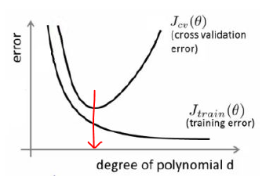

[TOC]

# Lec 07-1 - Application & Tips: 학습률(Learning Rate)과 데이터 전처리(Data Preprocessing)

> 학습률(Learning Rate)과 데이터 전처리(Data Preprocessing)에 대해 알아본다.

## Learning Rate

- 모델을 만들기 위한 hyperparameter 중 하나
  - *hyperparameter* : 미리 설정해두는 값
- 최적의 Gradient 도출하는 데에 필요한 변화율

```python
# Tersorflow Code
def grad(hypothesis, labels):
    with tf.GradientTape() as tape:
        loss_value = loss_fn(hypothesis, labels)
    return tape.gradient(loss_value, [W, b])

# learning rate를 어떤 Optimizer에 적용시킬지
optimizer = tf.train.GradientDescentOptimizer(learning_rate=0.01)
optimizer.apply_gradients(grads_and_vars=zip(grads, [W, b]))
```


### Learning ability according to Learning rate


- Learning rate의 크기에 따라 학습 능력치에 차이가 생김
- Learning rate는 높을수록 학습 능력이 현저히 떨어짐
  - 이를 **Overshooting**한다고 한다.
- 일반적인 Learning Rate
  - 0.01
  - *Adam Optimizer*: 3e-4(0.0003)

### Annealing the learning rate

- 좋은 learning rate 값을 찾았다고 해도 학습 과정에서 learning rate를 적절히 조절하는 것이 중요(***Learning Decay 기법***)
  - 어느 시점부터는 더이상 cost가 떨어지지 않기 때문에 learning rate를 조절하면서 이를 해결해야 한다.


- Learning Decay 기법

  - Step decay : N epoch or validation loss

  - Exponential decay = α = α0e-kt

    ```python
    learning_rate = tf.train.eponential_decay(starter_learning_rate, global_step, 1000, 0.96, staircase=True)
    ```

  - 1/t decay : α = α0/(1+kt)

  ```python
  # tf.train.exponential_decay
  # tf.train.inverse_time_decay
  # tf.train.train.natural_exp_decay
  # tf.train.piecewise_constant
  # tf.train.polynomial_decay
  ```

## Data preprocessing

### Feature Scaling

- 실제 데이터들이 일정 범위 안에 속해 있지만, 간혹 범위 밖의 데이터가 존재
  - 이 데이터는 사실상 모델을 만들 때 의미 X (*Noisy Data*)
- 이를 표준화 또는 정규화 한다.

#### Standardization(표준화)

- 평균으로부터 얼마나 떨어져 있는 데이터인지 수치로 정의(*Mean Distance*)

- **X_new = ( X - μ ) / σ**

  ```python
  Standardization = (data - np.mean(data)) / sqrt(np.sum(data - np.mean(data))^2 / np.count(data))
  
  # standard deviation(표준편차) : sqrt(np.sum((data - np.mean(data))^2) / np.count(data))
  ```

#### Normalization(정규화)

- Data를 0과 1 사이의 값으로 표현하는 것을 의미

- **X_new = (X - X_min) / (X_max - X_min) **

  ```python
  Normalization = (data - np.min(data, 0)) / (np.max(data, 0) - np.min(data, 0))
  ```

### Necessity of Data Preprocessing

- 유치원생의 공던지기 놀이 결과 데이터에 일부 데이터가 너무 높은 값이 있을 때***(수치형 데이터)***
- 자연어 처리할 때 필요 없는 조동사, 조사, 특수문자 등을 제거해야 할 때***(자연어 데이터)***
- 얼굴 인식 모델에 필요한 얼굴 이미지에서 배경과 그 외 부수적인 부분을 제거해야 할 때***(이미지 데이터)***

---

# Lec 07-2-1 -  Application & Tips: 오버피팅(Overfitting) & Solutions

> 오버피팅(Overfitting)과 그 해결책에 대해 알아본다.

## Overfitting

- *'과하게 맞춰져 있다.'*
- 학습 데이터에만 맞게 모델이 잘 만들어져 테스트 데이터를 입력했을 시 정확도가 오히려 떨어지는 현상

### 해결법

#### Set a features

- Get more training Data

  - 아주 많은 양의 데이터를 넣는다.

- Smaller set of features

  - 차원 축소(PCA)

    ```python
    # Sklearn Code
    from sklearn.decomposition import PCA
    pca = decomposition.PCA(n_components=3) # PCA를 3차원으로 설정
    pca.fit(X)
    X = pca.transform(X)
    ```

    

- Add additional features

  - 차원 증가
  - 실제 모델이 단순할 경우 의미가 없을 수 있다. -> 모델 구체화 필요
  - Fixes high bias
  - 위의 방법들과는 반대되는 경우에 이용(underfitting)



- 궁극적으로 Feature의 적당한 갯수를 찾으면 Overfitting이 해결된다.(빨간 화살표)

#### Regularization(Add term to loss)

- 학습과정에 loss에 특정 값을 추가하여 Overfitting 해결
- (ex) Linear regression - Cost Function에 모델 파라미터 값과 람다 값을 더해줌으로서 해결(수식은 pdf 참고)
- 특정 Weight가 너무 크게 나오는 경우에 사용

```python
# Tensorflow Code
L2_loss = tf.nn.l2_loss(w) # output = sum(t**2) / 2
```

#### 그 외

- Data Augmentation
  - (Image Data)
    - Color Jilttering
    - Horizontal Flips
    - Random Crops/Scales
- Dropout(0.5 is common)
- Batch Normalization

---

# Lec 07-3-1 - Application & Tips: Data & Learning

> 데이터 세트와 학습에 관련한 기법들을 알아본다.

## Data

### Training / Validation / Testing Data

- 학습 / 평가 / 테스트 데이터
- 학습 데이터와 평가 데이터를 구성할 때, 최대한 학습 데이터도 평가 데이터도 다양한 종류의 데이터로 나눠야 한다.
  - 만약 편향적인 데이터로 구성한 학습 데이터로 모델을 training 시키면, 남은 평가 데이터를 다 못 맞추는 결과 초래

```python
# tensorflow MNIST
mnist = tf.keran.datasets.mnist
# 60,000 trainig / 10,000 testing images
(x_train, y_train), (x_test, y_test) = mnist.load_data()
# 20% validation data
model.fit(x_train, y_train, validation_split=0.2, epochs=5)
```

### Evaluating a hypothesis

- Layer 구성, Learning Rate 설정, Optimizer 구성 등으로 모델 구성
  - 새로운 데이터로 이를 평가

```python
test_acc = accracy_fn(softmax_fn(x_test), y_test) # define hypothesis and test
model.evaluate(x_test, y_test) # Keras
```

### Anomaly Detection(이상탐지)

- 보통은 학습 데이터와 평가 데이터를 가지고 모델을 만듦
- 이상감지 모델은 새로운 방법으로 만드는 경우가 있음

#### GANs

- 건강한 데이터를 가지고 모델을 만들면, 건강한 데이터에 대해서만 잘 찾기 마련
- GAN이라는 네트워크를 이용하여 새로운, 특이한 데이터가 들어오면 Anomalies를 검색할 수 있게 됨

## Learning

### Online vs. Batch(Offline) Learning

|             | Online Learning  | Batch(Offline) Learning |
| ----------- | ---------------- | ----------------------- |
| Data        | Fresh            | Static                  |
| Network     | connected        | disconnected            |
| Model       | Updating         | Static                  |
| Weight      | Tunning          | Initialize              |
| Infra(GPU)  | Always           | Per call                |
| Application | Realtime Process | Stopping                |
| Priority    | Speed            | Correctness             |

### Fine Tuning/ Feature Extraction

- 예를 들어 얼굴 구분 모델은 인종에 따라 구분을 못할 수도 있음
- 보완하기 위한 기법
  - **fine-tune** : 기존 모델의 weight값을 미세하게 조절하며 학습을 시킴
  - **Feature Extraction** : 기존 모델은 그대로 둔 후 새로운 task에 대해서만 학습을 시킴

```python
saver = tf.train.import_meat_graph('my-model-1000.meta')
saver.restore(tf.train.latest_checkpoint('./'))
```

### Efficient Models

- Fine-tunning/Feature extraction 등을 통해 모델을 만들었다 하더라도, 효과적인 모델인지 생각해야 함
  - 속도 / 퍼포먼스도 중요! (Less inference time is needed)
    - weight의 경량화가 필요
    - fully connected layers => 1 x 1 convolutions로 대체 하는 등의 기법
    - Squeezenet, Mobilenet 등의 논문도 있음(low demension)

```python
tf.nn.depthwise_conv2d(input, filter, strides, padding)
```

