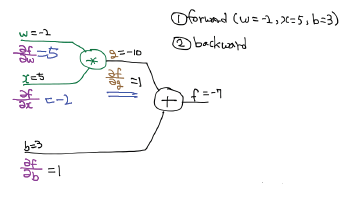

[TOC]


# Lec 09 - 1 - XOR 문제 딥러닝으로 풀기

> 딥러닝으로 XOR 문제를 풀어본다

## XOR Model

- 하나의 Logistic Regression으로는 XOR를 풀 수 없음이 증명되었음
- 따라서 다수의 Logistic Regression로 Neural Network를 구성하면 될 것이라 생각함
  - 하지만 이런 경우 W, b는 어떻게 학습 시키는가?

### XOR using NN


#### 증명

- 각 Logistic Regression의 weight와 bias가 위와 같다고 가정
- 첫 번째 Logistic Regression의 Y1 값은 0이 된다
  - 0 * 5 + 0 * 5 - 8 = -8 --->[Sigmoid] ---> 0
- 두 번째 Logistic Regression의 Y2 값은 1이 된다
  - 0 * (-7) + 0 * (-7) + 3 = -3 --->[Sigmoid] ---> 1
- 세 번째 Logistic Regression의 Y_hat 값은 1이 된다
  - 0 * (-11) + 1 * (-11) - 5 = 6 --->[Sigmoid] ---> 0
- 따라서 X1 = 0, X2 = 0일 때, XOR 연산한 Y_hat은 0이 되므로, 예상한 값과 같다.
- 모든 X1, X2 쌍에 대해서 모두 계산해보면 XOR 연산에 대한 NN을 만들 수 있다는 것을 증명할 수 있다.

### Weight and Bias

- 그럼 위의 예시 외의 Weight와 Bias로도 XOR NN를 만들 수 있는가? -> 이것은 숙제!
- 위의 예시에서는 3개의 unit으로 된 NN를 구성했지만, 이를 2개의 unit으로 새로 구성할 수 있다. 아래에 적은 [Vertor](#Vector) 참고

----


# Lec 09-2 - 딥네트워크 학습 시키기 (backpropagation)

> XOR 문제 해결을 위한 딥러닝 모델을 학습시킨다.

## XOR 딥러닝 모델 만들기

### Gradient Desenct Algorithm 이용

- 미분값이 0이 되는 곳을 찾아가는 기법

### Derivation

- X1, X2, X3, ... 등이 Y_hat에 미칠 영향(편미분값)를 알아야 한다.
  - 각 레이어마다 알아야 함
  - 하지만 이건 매우 어려운 일..
  - Backpropagation의 등장

### Backpropagation(Chain Rule)

- 예측값과 실측값의 차이(오류, error/cost)를 뒤에서부터 앞으로 전달하며 미분값과 weight 값 등을 조절하는 기법

#### 간단한 예시



- f = wx +b, g = wx의 그래프를 위와 같이 표기
- forward propagation의 값이 위와 같다고 가정
- 각 편미분 값이 y_hat에 주는 영향을 의미
  - f에 대한 w 편미분 = 5 (chain rule에 의해)
    - w가 1 변할 때 y_hat은 5 변한다는 것을 의미
  - f에 대한 x 편미분 = -2
    - x가 1 변할 때 y_hat은 -2 변한다는 것을 의미
  - f에 대한 b 편미분 = 1
    - b가 1 변할 때 y_hat은 1 변한다는 것을 의미
- 보다 복잡한 연산도 chain rule을 이용해 편미분값을 거꾸로 구해가며 각 property가 결과에 미치는 영향을 구할 수 있다.
- 흐음... 미분 공부해야겠다...ㅠㅠ

#### Backpropagation in Tersorflow

- TensorBoard에 값들이 남아 있음 -> 이를 Tensorflow가 미분하며 backpropagation을 하기 때문에 우리가 직접 구현할 것이 없음

---

# Lab 09-1 - Neural Net for XOR

> 신경망 네트워크를 코드로 구현하여 XOR 문제를 해결한다.
## Logistic Regression
- [Recap](./Lec 05 - Logistic Regression_Classification.md)

### Logistic Regression for XOR

> X1과 X2가 같으면 0, 다르면 1 출력

| X1   | X2   | XOR  |
| ---- | ---- | ---- |
| 0    | 0    | 0    |
| 0    | 1    | 1    |
| 1    | 0    | 1    |
| 1    | 1    | 0    |


- 위의 그래프를 기존에 배운 Logistic Regression으로**만** 표현하는 것은 한계가 있다.

### Forward Propagation

- 다수의 Linear Regression을 통해 XOR를 구현할 수 있다.

  

### Neural Net

- **Logistic Regression 한 개** : Linear Function + Logistic Function + Decision Boundary

- 위의 그림은 Layer가 2개인 경우 --> 2 Layer

```python
# Tensorflow Code
def neural_net(features):
    layer1 = tf.sigmoid(tf.matmul(features, W1) + b1)
    layer2 = tf.sigmoid(tf.matmul(features, W1) + b2)
    hypothesis = tf.sigmoid(tf.matmul(tf.concat([layer1, layer2], -1), W3) + b3)
    return hypothesis
```

#### Vector

- Layer에 있는 다수의 Linear Regression도 벡터를 이용해 하나의 Component로 합칠 수 있다.

  

```python
# Tensorflow Code
def neural_net(features):
    layer = tf.sigmoid(tf.matmul(features, W1) + b1)
    hypothesis = tf.sigmoid(tf.matmul(layer, W2) + b2)
    return hypothesis
```

### Chart

- 위와 같이 다양한 컴포넌트 조합을 통해

  - RNN
  - LSTM
  - AE

  등을 만들어 낼 수 있다.

## 실습

- [lec9-1_nn_for_xor](./practice/lec9-1_nn_for_xor.ipynb)