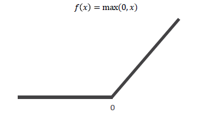

[TOC]

# Lab 10-1 - Sigmoid 보다 ReLU가 더 좋아

> ReLU 활성화 함수에 대해 알아본다.

## Problem of Sigmoid

- Input --> Network --> Output
  - 이 때의 ground-truth와 output의 차이를 loss(또는 cost)라고 한다.
  - Loss를 미분한 것을 Backpropagation 하면서 weight와 bias를 학습
    - d(loss) - gradient (loss를 미분)
    - 여러 Layer 사이에 있는 Activation Function으로 Sigmoid로 쓰다보면, Backpropagation하면서 loss값이 점차 상실된다. (**Vanishing Gradient**)
      - Sigmoid는 x가 -∞나 ∞로 갈수록 미분값이 0에 수렴(거의 0)하기 때문
      - 다수의 Sigmoid 미분값을 곱하면 이런 0으로 수렴하는 값때문에 loss가 상실된다는 것

## ReLU

- f(x) = max(0, x)

  - x가 0보다 작은 경우에는 0, 0보다 큰 경우에는 x를 취한다.

    

  - 장점 : x가 0보다 클 때의 미분값은 항상 1이기 때문에, loss가 상실되는 경우가 없다.

  - 단점 : x가 0보다 작을 때의 미분값은 항상 0이기 때문에, loss가 전달되지 않는다.

- ***왜 쓸까?*** : 단점이 존재하더라도, Backpropagation이 잘 되기 때문에 많이 쓴다.

- 그 외에 쓰는 Activation Function

  `tf.keras.activations` 안에 Activation Function이 있으므로, 바꿔가면서 성능차이 확인 및 Model 학습을 해볼 것

  - tanh
  - elu
  - selu
  - leaky relu : `tf.keras.layers` 안에 있음
    - x가 음수일 때, 어떤 α 값을 x에 곱한 값으로 되어 있다.(보통 α는 0.1이나 0.01)
    - x가 양수일 때는 ReLU와 같음

