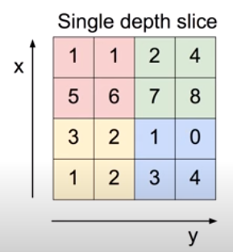

[TOC]

# Lec 11-1 - ConvNet의 Conv 레이어 만들기

> 합성곱 신경망(Convolutional Neural Network)의 합성곱 층(Convolution Layer)에 대해 알아본다.

## Recap

- Fully Connected Layer
  - 모든 레이어가 연결이 된 레이어들의 집합

## Convolutional Neural Networks

### CNN의 시작

- 고양이 뇌 실험에서 시작
- 이미지의 일부를 바라보는 뉴런이 있고, 그 뉴런도 모든 뉴런이 아닌 일부 뉴런이었음
- 이에 착안하여 CNN 모델이 탄생

### CNN 구성(Fully-Connected Conv Layer)

- Conv Layer
- Activation Function Layer(ReLU)
- Pooling Layer

### CNN 구동(예시)

#### 32 * 32 * 3 image (Width * Height * Depth)

- 컬러 사진을 이용할 때, RGB 색상으로 나눌 수 있으므로 depth는 3이 됨

#### 5 * 5 * 3 filter

- 고양이 뇌실험처럼 일부를 봐가면서 학습하기 위해 filter를 이용
- filter의 크기(widht x height)는 임의로 결정 가능
- 이 filter에 걸리는 값을 이용 하나의 숫자(one number)를 도출
  - Linear Regression(`Wx + b`)를 여기서 활용
  - 또는 `ReLU(Wx+b)`를 활용

#### How many numbers can we get?

##### Stride

- stride가 1일 때, 위의 예시를 통해서 얻을 output의 갯수는 28 * 28 개다.

  - N : width or height of the image

    F : width or height of ther filter

    (((N-F) / stride) + 1) * (((N-F) / stride) + 1)

  - stride : filter 이동하는 정도/거리, 1일 때 한 칸 씩 움직인다는 의미

  - stride의 값에 의해 output 크기가 소수점이 나오는 경우도 있음 -> 이 때의 stride는 이용할 수 없음

##### padding

- 실제로 사용할 때는 padding을 이용함
- 이미지의 테두리에 0의 값을 둘러준다.
- Why using padding?
  - 그림이 급격히 작아지는 것을 방지
  - 모서리를 네트워크에 알려주기 위함

- pad with 1 pixel -> how many output ?
  - (((N - F + 2 * padding) / stride) + 1) * (((N - F + 2 * padding) / stride) + 1) 

#### Swipping the entire image

- weight이 각각 다른 6개의 filter를 이용하면 6개의 activation map이 생긴다.

  

  - filter의 weight 갯수 : 6 * 5 * 5 * 3개 -> 10 * 5 * 5 * 3개

---

# Lec 11-2 - ConvNet Max pooling 과 Full Network

> 합성곱 신경망(Convolutional Neural Network)의 풀링 층(Pooling Layer)에 대해 알아본다.

## Pooling Layer(=sampling)

- Conv Layer에서 한 Layer씩 뽑아 resizing하여 다시 쌓는 것을 의미

  

### Max Pooling

- 위의 Layer를 2 * 2 filter와 stride = 2로 max pool한다면?

  - 각 filter 안에서 **가장 큰 숫자**를 골라 Layer resizing을 한다.

  | 6    | 8    |
  | ---- | ---- |
  | 3    | 4    |

---

# Lec 11-3 - ConvNet의 활용예

> 더 많은 합성곱 신경망(Convolutional Neural Network) 구조에 대해 알아본다.

## Case Study

### LeNet-5

- 32 * 32 * 1 images
- 6 of 5 * 5 * 1 filters
- 2 * 2 filters at stride 2 for pooling

### AlexNet

> 매우 유명

- 227 * 227 * 3 images
- **First Layer** 96 11 * 11 filters at stride 4
  - Output = 55 * 55 * 96
  - Parameters : (11 * 11 * 3) * 96 = 35K
- **Second Layer** 3 * 3 filters at stride 2 for pooling
  - Output = 27 * 27 * 96
- 위의 Layer 포함하여 총 Conv 5개, Max Pool 3개, Normalization 2개, FC 3개 이용
- ReLU 최초 사용
- dropout 0.5
- batch size 128
- CNN 7개 만듦

### GoogLeNet

- Inception Module

### ResNet

- ILSVRC 2014 winner
- error : 3.5% (사람의 error 5%)

### CNN for Sentence Classification

- Yoon Kim, 2014

### DeepMind's AlphaGo

- 19 * 19 * 48 images
- zero padding
- k filters of nernel size 5 * 5 with stride 1 
- etc..

