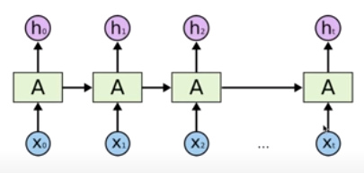
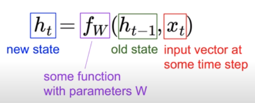
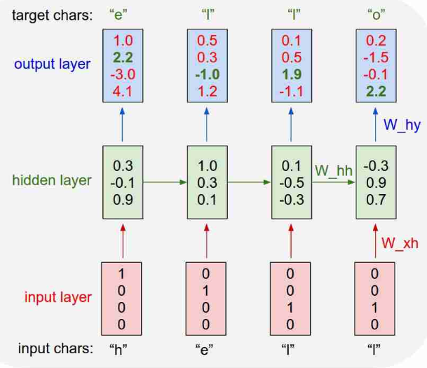

[TOC]

# Lec 12 - NN의 꽃 RNN 이야기

> 순환 신경망(Recurrent Neural Network)에 대해 알아본다.

## Sequence Data

- 어떤 데이터가 시계열 특징이 있을 때
- 이전 데이터가 다음 데이터에 영향을 미칠 때
- (ex) 음성인식, 자연어 데이터 등
  - 하나의 단어로만 전체 맥락을 알 수 있지 않음
- NN / CNN으로는 이를 판단 불가

## RNN



- X0를 A라는 수식에 넣으면 h0(또는 Y0)라는 결과 값이 나오는데, 이는 다음 h1을 도출할 때, 새로운 input과 함께 영향을 준다는 의미

### State

- RNN 연산 중 어느 한 시점에서의 결과 값



- Vanilla RNN을 통해 h_t 연산 후, 최종 y_t 도출

  `h_t = tanh(W_hh * h_(t-1) + W_xh * x_t)`

  `y_t = W_hy * h_t`

  - 여기서는 f_w로 tanh를 사용

## Character-level language model example

### word training of  'hello' 

- x0, x1, x2, x3, x4 = 'h', 'e', 'l', 'l', 'o' 입력
- 이 때, 'h', 'e', 'l', 'o' 각 글자에 대한 one-hot encoding이 선행되어야 함
- 첫 state 학습 후 나온 결과 값(hidden layer)을 다음 state의 input값으로 함께 이용
- output layer는 state 값을 이용하여 도출



- 두 번째 output layer의 경우, 원하는 답과 실제 답이 다름 -> softmax로 해결


## RNN 활용 예시

- Language Modeling
- Speech Recognition
- Machine Translation
- Conversation Modeling/Question Answering
- Image/Video Captioning
- Image/Music/Dance Generation

### Multi-Layer RNN

### LSTM

### GRU

---

# Lab 12-0 RNN Basic

```
* 강의 들으면서 이해하기 어려웠던 부분들이 있었습니다. 다른 분들도 그러실 것 같다는 생각에 내용 덧붙입니다.

[30초 기준]:
hidden_size 는 output , 즉 출력의 크기를 설정
x_data는 Xt, 즉 input 데이터의 값

그리고 나서 rnn(x_data)하면 output, states가 나온다.
output은 나온 ht값
states는 옆으로 이동해서 영향을 줄 states의 값

[45초 기준]:
RNN을 만드는 방법이 2가지인 이유.
모든 구성을 다 만들어놓고서 A, 즉 몸통만 바꾸고 싶을 수가 있기 때문
첫 번째 방식처럼 나눠서 하면 A만 바꿔서 lstm, gru 등 다른 방식으로 테스트해볼 수가 있음
그러나 두 번째 방식으로 하면 A만 바꿔서 테스트할 수가 없음

[1분 20초 기준]
batch_size:
데이터를 몇 개 줄 것인지?
hello, eolll, lleel 로 3개의 줄을 보낸다면 batch_size는 3임

sequence_length:
'RNN 모듈이 시계열 방식으로 여러 개가 나열될 건데
몇 개의 셀을 나열할 것인가?' 에서 
나열할 RNN의 개수를 말하는 것

[1분 30초 기준]
hidden_size는 본인이 설정하고 싶은데로 임.

- 박동민님 댓글
```

